# Roteiro de Instalação e Configuração de Gateway LoRaWAN na The Things Network (TTN)

<!--  -->
<div style="text-align: right">
  
</div>

Este material foi produzido pelo [Instituto Federal de Santa Catarina (IFSC) - Campus São José](https://www.sj.ifsc.edu.br), no contexto do projeto de [TTN-IFSC-SJE](https://github.com/arliones/TTN_IFSC_SJE). Este roteiro consiste em uma versão atualizada do roteiro desenvolvido em projeto anterior em parceria entre [IFSC e FAPESC](https://github.com/arliones/configuracoes-gateway-ttn/).

Este roteiro guia a configuração e instalação de um Gateway LoRaWAN na [TTN](https://www.thethingsnetwork.org/) utilizando o módulo RF RHF0M301 RISINGHF montado sobre uma RaspberryPi.

## Importante
📗 Leia este roteiro até o final antes de começar.

☺️ Caso encontre algum erro, tenha alguma sugestão ou dúvida, fique a vontade para entrar em contato.

## Requisitos
* Conhecimento básico em Linux
* Acesso ao [GitHub](https://github.com/)
* Acesso em [The Things Network](https://www.thethingsnetwork.org/)
* Uma RaspberryPi 3 ou mais recente
* Um módulo RF de gateway LoRaWAN modelo RisingHF RHF0M301.

## Sumário
1. [Materiais utilizados](#Materiais-utilizados)
2. [Iniciando](#Iniciando)
3. [Montagem](#Montagem)
4. [Configuração](#Configuração)
   1. [Configuração da RPi](#Configuração-da-RPi)
   2. [Configuração do *Gateway* LoRaWAN](#Configuração-do-*Gateway*-LoRaWAN)
5. [Registro na TTN](#Registro-na-TTN)

# Materiais utilizados

* Cartão microSD [(especificações)](https://www.raspberrypi.org/documentation/installation/sd-cards.md).
* Leitor de cartão microSD para laptop/desktop.
* Raspberry Pi 3 Model B V1.2 (**RPi**).
* Módulo Gateway LoRaWAN ([RHF0M301](https://www.robotshop.com/media/files/pdf/915mhz-lora-gateway-raspberry-pi-hat-datasheet1.pdf)) RISINGHF.
* Adaptador para módulo RHF0M301 RISINGHF Gateway LoRaWAN.
* Antena 915 MHz.
* Duas fontes chaveadas 5V 3A com conector microUSB.
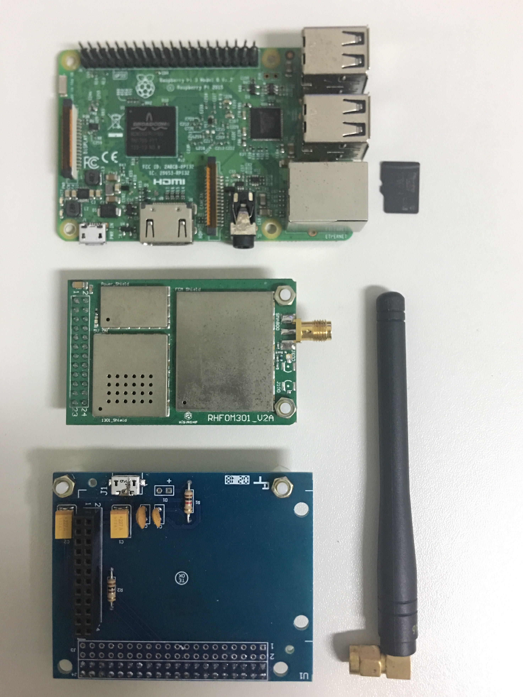
* Para configuração do gateway também são necessários
  * Monitor com entrada HDMI.
  * Teclado USB.
  * Cabo HDMI.
  * Cabo de rede ou acesso a rede Wi-Fi.

# Iniciando

Primeiramente é necessário preparar o cartão SD. O passo a passo detalhado pode ser seguido a partir do [link](https://www.raspberrypi.com/software/) e consiste em:

* Em um laptop/desktop, baixar e instalar o software Raspberry Pi Imager.
* Inserir cartão de memória micro-SD no laptop/desktop.
* Abrir o software RPi-Imager.
* Selecionar o sistema operacional desejado: Raspberry Pi OS (32-bit).
* Selecionar o cartão de memória que deseja gravar.
* Clicar no botão "Write" e aguardar conclusão (pode levar muitos minutos, dependendo da velocidade da conexão com a Internet para baixar a imagem do sistema operacional).

# Montagem

Insira o cartao microSD gravado na RPi. Encaixe o adaptador, o módulo RF do gateway gateway e a antena. Este deve ser o resultado final do hardware:

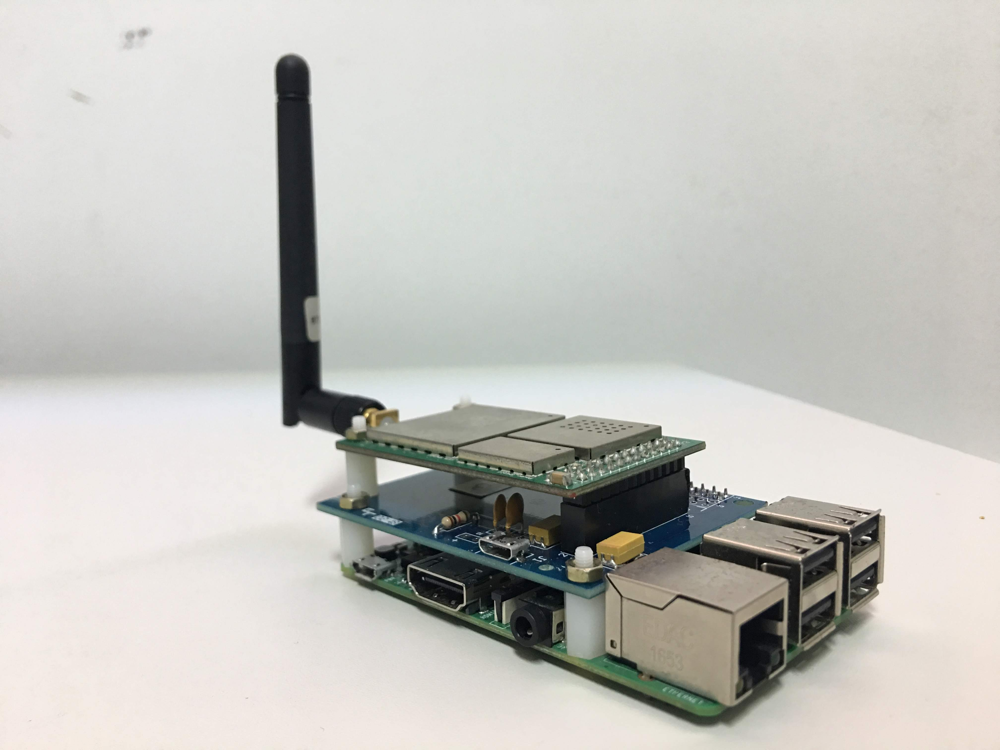

A encaixe entre a RPi e o adaptador e entre o adaptador e o módulo usando a placa adaptadora para módulo RHF0M301 RISINGHF acontece de forma perfeita (todos os pinos machos conectados aos fêmeas) sem a necessidade da utilização de jumpers, como pode ser visto na imagem.

Conecte a RPi e o adaptador às fontes de energia microUSB e ao cabo Ethernet (não energize o módulo LoRaWAN sem que a antena esteja conectada). 

> É recomendado que os equipamentos sejam fixados em uma caixa ambiental hermética para evitar dados de exposição ao Sol e humidade. Se fizer esta escolha tome cuidado para sempre deixar os conectores da RPi livres e de fácil acesso para conexão dos cabos.

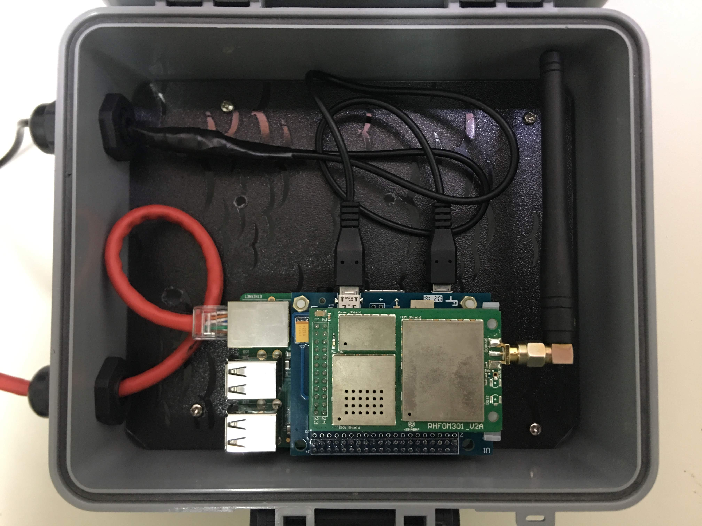

Caso a conexão entre o módulo RF e a RPi não use uma placa adaptadora, as conexões devem ser feitas conforme a pinagem:

Descricao      | Pino físico na RPi 
:-------------:|:-----------------:
Alimentacao 5V | 2
GND            | 6
Reset          | 22
SPI CLK        | 23
MISO           | 21
MOSI           | 19
NSS            | 24

# Configuração

Agora está tudo pronto para ligar e configurar o gateway. Para isso, você deve conseguir acessar o terminal da RPi. Existem algumas opções para isso e você pode escolher uma delas [aqui](https://www.raspberrypi.org/documentation/remote-access/ssh/). A senha padrão para o usuário **pi** é **raspberry**.

Vale lembrar que o dispositivo deve estar conectado à Internet para realizar as proximas operações. Essa conexão pode ser feita via cabo ou usando o [Wi-Fi](https://www.raspberrypi.org/documentation/configuration/wireless/wireless-cli.md).

## Configuração da RPi

Já com o acesso ao terminal da RPi use o comando raspi-config para configurar local, timezone, habilitar a interface SPI e redimensionar a partição do cartão SD.

Execute o seguinte comando para abrir o software de configuração da RPi:
```sh
sudo raspi-config
```
No menu que abre, ajuste as seguintes opções, conforme sua região:
* 5 Localisation Options -> L1 Locale
* 5 Localisation Options -> L2 Timezone

Em seguida, ligue a interface o SPI:
* 3 Interface Options -> P4 SPI

E, finalmente, expanda o tamanho da partição do sistema para que use todo o cartão microSD:
* 6 Advanced options -> A1 Expand Filesystem

Ao sair, deve surgir um pedido para reiniciar o sistema (*reboot*). Confirme e aquarde o reboot (ou use o comando *sudo reboot* para reiniciar manualmente).

Após a reinicialização, conecte novamente ao console da RPi e:

* Atualize o sistema e instale o git:
```sh
 sudo apt-get update
 sudo apt-get upgrade
 sudo apt-get install git
```

## Configuração do *Gateway* LoRaWAN

### Identificador EUI-64 do *gateway*
O primeiro passo é identificar o EUI do gateway. O EUI é um identificador único do gateway formado por 64-bits. Neste tutorial, criaremos um EUI-64 a partir do endereço MAC de 48 bits da placa de rede da RPi.

Ao conectar ao terminal da RPi digite:
```sh
ifconfig
```
O comando deve gerar uma saída parecida com a seguinte:

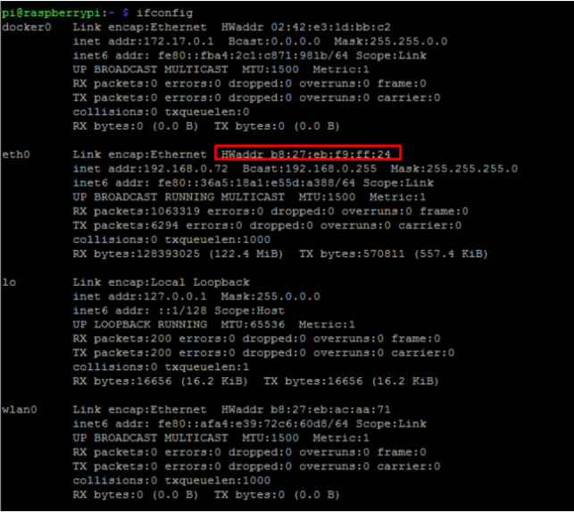

O número destacado em vermelho é o endereço MAC da RPi e será a base para o EUI-64 do *gateway*. Este número será extendido adicionando 2 bytes **FF** no meio, portanto:

|    HWaddr   |       b 8 : 2 7 : e b : f 9 : f f : 2 4       |
|:-----------:|:---------------------------------------------:|
| **Gateway EUI** | **b 8 : 2 7 : e b : F F : FF : f 9 : f f : 2 4** |

Para facilitar consultas futuras, recomendamos criar um arquivo chamado "gateway_EUI.txt" na RPi. Para isso, execute:
```sh
nano ~/gateway_EUI.txt
```
No editor de texto que abrirá, digite o número EUI-64 sem os separadores e usando caracteres maiúsculos (ex.: B827EBFFFFF9FF24). Ao final, pressione Ctrl+x para sair (e salvar o arquivo). Mantenha este número anotado para uso futuro.


### Configuração remota

Os gateways TTN podem ser ajustados para permitir configuração remota. Nesse caso, é verificado se há um novo arquivo de configuração em cada inicialização do dispositivo e, caso haja, o arquivo de configuração local é substituido.

Para utilizar esta opção é preciso criar um arquivo JSON com o nome da EUI no repositório [ttn-zh/gateway-remote-config](https://github.com/ttn-zh/gateway-remote-config). Isso consiste em:

- Criar um arquivo JSON com o **EUI** do gateway em letras maiúsculas, contendo as informações sobre o mesmo. O arquivo deve ser adicionado usando *Create new file*:
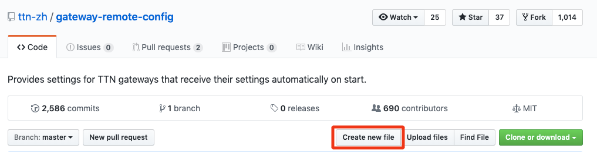
Por exemplo, se o EUI-64 do *gateway* for **B827EBFFFFF9FF24**, o arquivo deverá ser chamado **B827EBFFFFF9FF24.json**. Os campos *gateway_ID*, *server_address*, *contact_email* e *description* são strings e devem conter aspas (""). Já os campos referentes a latitude, longitude e altitude são apenas números, não levam aspas. O conteúdo do arquivo deve ser:
```json
{
  "gateway_conf": {
    "gateway_ID": "INSIRA_SEU_GATEWAY_EUI_AQUI",
    "servers": [
      {
        "server_address": "router.us.thethings.network",
        "serv_port_up": 1700,
        "serv_port_down": 1700,
        "serv_enabled": true
      }
    ],
    "ref_latitude": 00.000000,
    "ref_longitude": -00.000000,
    "ref_altitude": 00.0,
    "contact_email": "INSIRA_SEU_EMAIL_AQUI",
    "description": "Uma descrição do dispositivo"
  }
}
```

- Solicitar a adição do arquivo ao repositório:
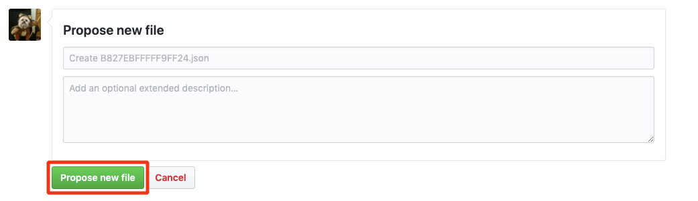

- Crie um *pull request* da solicitação:
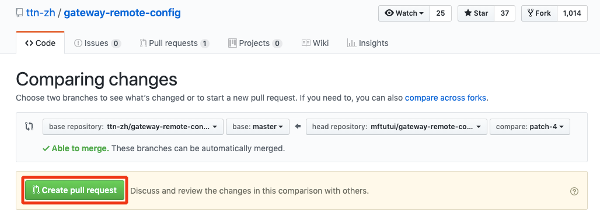

- Confirme a solicitação:
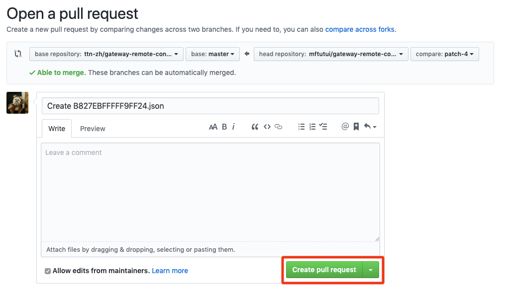

Agora é só esperar que o moderador do serviço de configuração remota aceite a solicitação.

### Instalando serviços do *gateway* LoRaWAN

Os serviços necessários para que o gateway opere serão obtidos no github e postos em execução. O primeiro passo é clonar os seguintes repositórios e construir os serviços. Estando conectado no terminal da RPi, execute:
```sh
cd /opt
sudo git clone https://github.com/Lora-net/packet_forwarder
sudo git clone https://github.com/Lora-net/lora_gateway
```

```sh
cd /opt/lora_gateway
sudo make -j4
cd /opt/packet_forwarder
sudo make -j4
```

Feito isso, vamos configurar o serviço packet_forwarder para o nosso gateway:
* Remova o arquivo **global_config.json** instalado por padrão:
```sh
sudo rm -rf /opt/packet_forwarder/lora_pkt_fwd/global_config.json
```
* Crie um novo (em /opt/packet_forwarder/lora_pkt_fwd/) com o conteúdo disponibilizado no arquivo **AU-global_conf.json** que se encontra [neste](https://github.com/TheThingsNetwork/gateway-conf/) repositório:
```sh
cd /opt/packet_forwarder/lora_pkt_fwd/
sudo curl -o global_conf.json https://raw.githubusercontent.com/TheThingsNetwork/gateway-conf/master/AU-global_conf.json
```

* Substitua o **gateway_ID** no arquivo **local_config.json** pelo EUI-64 do *gateway*:
```sh
sudo nano /opt/packet_forwarder/lora_pkt_fwd/local_conf.json
```
```
{
/* Put there parameters that are different for each gateway (eg. pointing one gateway to a test server while the others stay in production) */
/* Settings defined in global_conf will be overwritten by those in local_conf */
  "gateway_conf": {
    "gateway_ID": "XXXXXXXXXXXXXXXX" /* you must pick a unique 64b number for each gateway (represented by an hex string) */
  }
}
```

### Habilitando serviço no gateway

* Configure o serviço no *systemd* criando o arquivo *gateway.service*
```sh
sudo nano /etc/systemd/system/gateway.service
```

* Inserir o conteúdo em *gateway.service*:
```
[Unit]
Description=TTN Gateway Service
After=multi-user.target
[Service]
WorkingDirectory=/opt/packet_forwarder/lora_pkt_fwd
Type=simple
ExecStartPre=/opt/lora_gateway/reset_lgw.sh start
ExecStart=/opt/packet_forwarder/lora_pkt_fwd/lora_pkt_fwd
Restart=always
RestartSec=10
[Install]
WantedBy=multi-user.target
```

* Para iniciar o serviço, execute as seguintes linhas para que o script do gateway rode em *background* sempre que o RPi for inicializado:
```sh
sudo systemctl daemon-reload
sudo systemctl enable gateway
sudo systemctl start gateway
```

* Conferir se o serviço está rodando
```sh
sudo systemctl status gateway -l
```

>Possível problema em versões mais novas do Raspbian:
```sh
lora_pkt_fwd[638]: ERROR: Failed to load fw 1
lora_pkt_fwd[638]: ERROR: Version of calibration firmware not expected, actual:0 expected:2
lora_pkt_fwd[638]: ERROR: [main] failed to start the concentrator
```
>Isso ocorre porque o novo kernel Linux bloqueia o GPIO07 por ser utilizado pelo SPI, e este pino é necessário para a comunicação entre a RPi e o módulo de RF. **Solução:** adicione a linha abaixo **ao final** do arquivo /boot/config.txt (use o comando "sudo nano /boot/config.txt").
```
dtoverlay=spi0-cs,cs1_pin=4
```
>Esta solução supõe que o pino GPIO04 está livre em sua placa. Se não estiver, substitua '4' pelo número de qualquer outro GPIO não utilizado.

# Registro na TTN

Agora você pode registrar o seu gateway na TTN!

* Neste ponto, partimos do princípio que você já possui uma conta na TTN. Neste caso, entre no [site da TTN](https://www.thethingsnetwork.org/), navegue até o **Console**, e selecione a região onde deseja registrar seu gateway (para o Brasil, usamos "North America 1"):
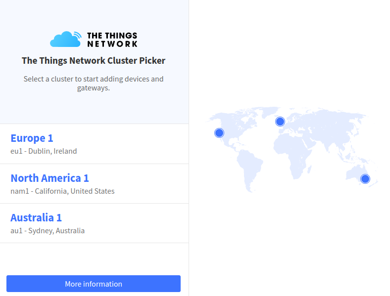

* Na tela inicial do console, clique em **Gateways**
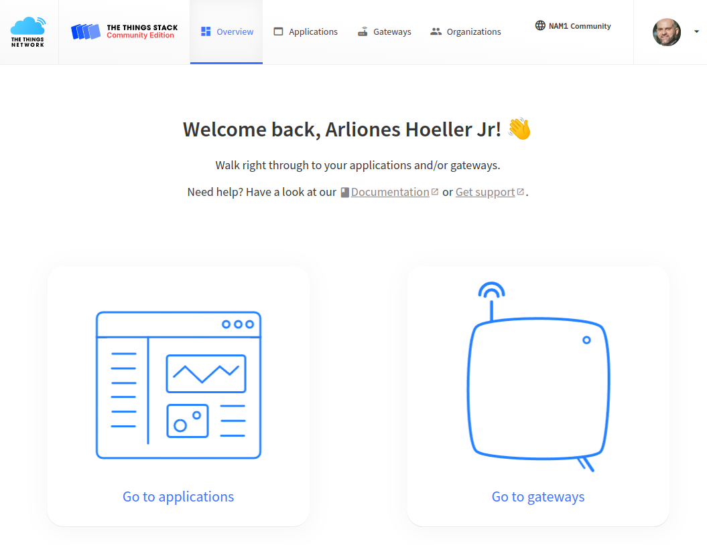

* Na tela que surge, clique em *+ Add gateway*
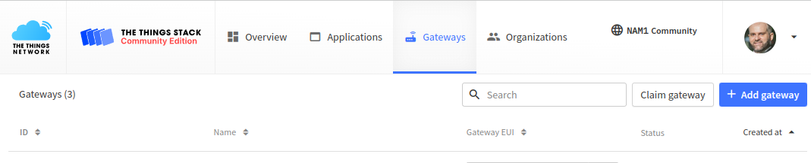

* No formulário que surge, preencha os campos do seguinte modo:
  * Na seção "General Settings":
    * Owner: usuário ou organização proprietária do *gateway*.
    * Gateway ID: nome identificador do gateway (ex.: indoor-gateway-01). Este nome será usado para identificar o gateway nos serviços da TTN, deve ser único na sua conta, e deve ser formado por caracteres alfanuméricos separados por hífen.
    * Gateway EUI : EUI-64 do *gateway* identificado anteriormente.
    * Gateway name: Um nome "humanizado" para o gateway (ex.: Gateway Indoor 01).
    * Gateway description: Descrição simplificada para o seu gateway, que pode ser utilizada para manter anotações importantes sobre o equipamento.
    * Deixe as opções "Require authenticated connection", "Gateway status" e "Gateway location" com suas configurações padrão.
  * Na seção "LoRaWAN options":
    * Frequency Plan: Frequência utilizada pelo gateway. Selecionar "Australia 915-928 MHz, FSB 2 (used by TTN).
    * Deixe as demais opções com seus valores padrão.
  * Clique em *Create gateway*.
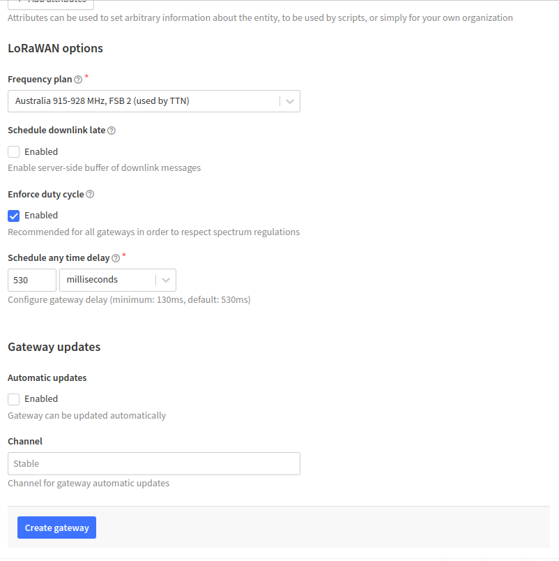

* Se tudo estiver OK, o *gateway* já deve estar enviando mensagens para o servidor. Para verificar, clique em *Gateways* no menu superior do console da TTN. Na tela que abre, clique sobre o identificador do *gateway* que você acabou de criar. Uma imagem similar à seguinte deve aparecer:


* Por padrão, o gateway envia a cada 30s um relatório com estatísticas de pacotes processados. Estas estatísticas devem aparecer na seção "Live data".
